<div align="center">

# 🔷 Hextech File Hosting

### A Self-Hosted CDN Management Panel with Zero-Trust Security

Upload, organize, and serve files through your own infrastructure with enterprise-grade Cloudflare protection.

[](LICENSE)
[](https://ghcr.io/v1ggs-dev/hextech-file-hosting)
[](https://go.dev/)
[](https://react.dev/)

[**Documentation**](https://hextech-app.v1ggs.lol) • [**Quick Start**](#quick-start) • [**Features**](#features) • [**Architecture**](#architecture)

</div>

---

## ✨ Features

| Feature | Description |
|---------|-------------|
| 📁 **File Management** | Upload, rename, move, and delete files and directories with an intuitive interface |
| 🔗 **Instant CDN URLs** | Generate and copy public URLs for any file with a single click |
| 📦 **Bulk Operations** | Multi-select files using `Ctrl+Click` and `Shift+Click`, download selections as ZIP |
| 📊 **Activity Logging** | Comprehensive audit trail tracking all file operations with timestamps and IP addresses |
| 🔒 **Zero-Trust Security** | Enterprise-grade authentication via Cloudflare Access — no exposed ports |
| 🎨 **Modern UI** | Responsive dark/light themes with six customizable accent colors |
| 🐳 **Docker Ready** | Production-ready containerized deployment with a single command |
| 🚀 **High Performance** | Optimized Go backend with intelligent caching and efficient file serving |

---

## 🏗️ Architecture

Hextech leverages Cloudflare's edge network for security and performance, ensuring your origin server remains completely hidden from the public internet.

```mermaid
flowchart TB
    subgraph Internet["🌐 Internet"]
        User["👤 User"]
    end
    
    subgraph Cloudflare["☁️ Cloudflare Edge"]
        direction TB
        Access["🔐 Cloudflare Access<br/><i>Zero-Trust Authentication</i>"]
        CDN["📦 CDN Caching<br/><i>Edge Distribution</i>"]
    end
    
    subgraph Tunnel["🔒 Cloudflare Tunnel"]
        T1["panel.domain.com"]
        T2["cdn.domain.com"]
    end
    
    subgraph Server["🖥️ Your Server (No Open Ports)"]
        Panel["⚙️ Hextech Panel<br/><i>Go + React</i><br/>Internal Only"]
        Nginx["📂 Nginx CDN<br/><i>Static File Server</i><br/>Internal Only"]
        Storage[("💾 File Storage")]
    end
    
    User --> Access --> T1 --> Panel
    User --> CDN --> T2 --> Nginx
    Panel --> Storage
    Nginx --> Storage
```



### Key Architectural Benefits

- **Zero Exposed Ports** — All traffic routes through Cloudflare Tunnel; no ports open to the internet
- **Edge Authentication** — Cloudflare Access validates users before requests reach your server
- **Global CDN** — Static files cached at Cloudflare's 300+ edge locations worldwide
- **Origin Isolation** — Your server's IP address remains completely hidden

---

## 🚀 Quick Start

### Prerequisites

| Requirement | Details |
|-------------|---------|
| **Server** | Ubuntu 20.04+ or any Docker-compatible Linux distribution |
| **Docker** | Docker Engine 20.10+ with Docker Compose V2 |
| **Domain** | Domain configured with Cloudflare DNS (free tier supported) |
| **Cloudflare** | Free Cloudflare account with Zero Trust enabled |

### One-Command Installation

```bash
curl -fsSL https://raw.githubusercontent.com/v1ggs-dev/hextech-file-hosting/main/install.sh | bash
```

The interactive installer will:

1. ✅ Verify and install Docker and Docker Compose if needed
2. ✅ Prompt for your panel and CDN domains
3. ✅ Guide you through Cloudflare Tunnel token generation
4. ✅ Generate all required configuration files
5. ✅ Pull Docker images and start all services

### Manual Installation

For users who prefer manual configuration:

```bash
# Create project directory
mkdir -p ~/hextech/files && cd ~/hextech

# Download example configurations
curl -O https://raw.githubusercontent.com/v1ggs-dev/hextech-file-hosting/main/docker-compose.example.yml
curl -O https://raw.githubusercontent.com/v1ggs-dev/hextech-file-hosting/main/nginx.conf.example
curl -O https://raw.githubusercontent.com/v1ggs-dev/hextech-file-hosting/main/.env.example

# Configure your environment
cp docker-compose.example.yml docker-compose.yml
cp nginx.conf.example nginx.conf
cp .env.example .env

# Edit configuration files with your domains and tokens
nano .env

# Deploy
docker compose up -d
```

---

## ⚙️ Configuration

All configuration is managed through environment variables, making it easy to customize for your deployment.

| Variable | Default | Description |
|----------|---------|-------------|
| `PORT` | `8080` | Internal server port (not exposed externally) |
| `PUBLIC_HOSTNAME` | `localhost` | Your CDN domain for generating public file URLs |
| `CDN_PATH` | `/srv/cdn` | Container path where files are stored |
| `ALLOWED_ORIGINS` | `*` | CORS origins for API access |
| `MAX_UPLOAD_SIZE` | `104857600` | Maximum file upload size in bytes (default: 100MB) |
| `BLOCKED_EXTENSIONS` | `exe,bat,sh...` | Comma-separated list of blocked file extensions |
| `DEV_MODE` | `false` | Bypass Cloudflare authentication (development only) |
| `DB_PATH` | `/data/hextech.db` | SQLite database file location |

> **Note:** See `.env.example` for a complete list of configurable options with detailed descriptions.

---

## 📖 Documentation

Comprehensive documentation is available at **[hextech-app.v1ggs.lol](https://hextech-app.v1ggs.lol)**

- 📋 **Installation Guide** — Step-by-step walkthrough with screenshots
- 🔧 **API Reference** — Complete REST API documentation
- 🔒 **Security Guide** — Implementation details and best practices
- 🏛️ **Architecture** — Deep-dive into system design and components

---

## 🛠️ Maintenance

Common maintenance commands for managing your Hextech deployment:

```bash
cd ~/hextech

# View real-time logs
docker compose logs -f hextech

# Update to the latest version
docker compose pull && docker compose up -d

# Backup the database
docker cp hextech-panel:/data/hextech.db ./backup-$(date +%Y%m%d).db

# Restart services
docker compose restart

# Stop all services
docker compose down

# View container status
docker compose ps
```

---

## 🔒 Security

Hextech implements multiple layers of security to protect your files and infrastructure:

| Layer | Implementation |
|-------|----------------|
| **Authentication** | Cloudflare Access with email-based zero-trust verification |
| **CSRF Protection** | Cryptographic token validation on all state-changing requests |
| **Path Traversal** | Strict path sanitization prevents directory escape attacks |
| **MIME Validation** | File content verification ensures uploaded files match their extensions |
| **Extension Blocking** | Configurable blocklist prevents upload of executable files |
| **Security Headers** | X-Frame-Options, X-Content-Type-Options, CSP headers enabled |
| **No Exposed Ports** | Cloudflare Tunnel eliminates direct server access |

For detailed security implementation, visit the [official documentation](https://hextech-app.v1ggs.lol).

---

## 🧰 Technology Stack

| Layer | Technologies |
|-------|--------------|
| **Backend** | Go 1.21, Chi Router, SQLite, GORM |
| **Frontend** | React 18, Vite, TailwindCSS, shadcn/ui, Radix UI |
| **Infrastructure** | Docker, Nginx, Cloudflare Tunnel, Cloudflare Access |
| **CI/CD** | GitHub Actions, GitHub Container Registry (GHCR) |

---

## 📄 License

This project is licensed under the **MIT License** — see the [LICENSE](LICENSE) file for details.

---

<div align="center">

### Built with ❤️ by v1ggs

[](https://v1ggs.lol)
[](https://github.com/v1ggs-dev)
[](https://x.com/v1ggs_)
[](mailto:v1ggs.tech@gmail.com)

---

⭐ **If you find Hextech useful, please consider giving it a star!** ⭐

</div>
